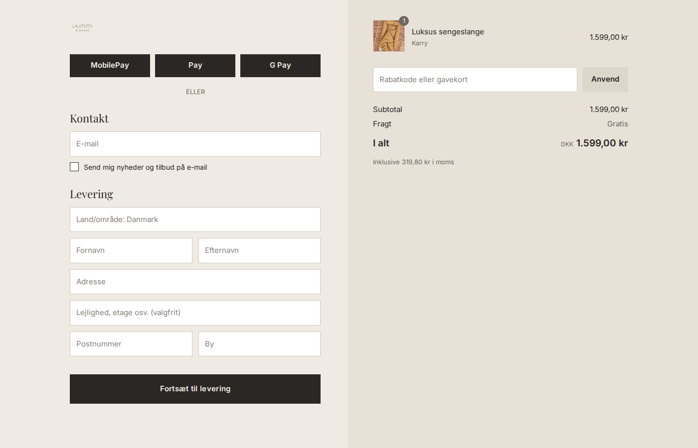

# Betalingsvinduet (checkout) i det nye design

Mockuppet er en tegning af, hvordan det kommer til at se ud. Shopify bestemmer selv den præcise opsætning.

Shopify tillader kun Plus-butikker at style betalingsvinduet med kode. Hos os
gøres det derfor i Shopifys egen editor. Værdierne herunder er de samme som i
det nye tema, så kurv og betaling ligner hinanden.

## Lav en kladde, så den nuværende side ikke ændres

1. **Indstillinger → Betaling (Checkout)**.
2. Under **Konfigurationer** ved «Lalatoto configuration»: klik på **…** →
   **Dupliker**. Kald kopien «Nyt tema 2026».
3. Klik **Tilpas** på kopien. Alt herunder gøres i kopien.
4. Kopien er ikke live, før der trykkes **Udgiv** på den. Det gøres samme dag,
   som det nye tema udgives.

## Indstillinger i editoren (tandhjulet «Indstillinger» i venstre side)

### Logo
| Felt | Værdi |
|---|---|
| Logo | Samme logo som i headeren (mørk version) |
| Position | Venstre |
| Størrelse | Mellem (logoet er lyst og tyndt, så det skal have plads) |

### Hovedområde (til venstre)
| Felt | Værdi |
|---|---|
| Baggrund | Farve `#EFEBE4` |

### Ordreoversigt (til højre)
| Felt | Værdi |
|---|---|
| Baggrund | Farve `#E7E1D8` |

### Skrifttyper
| Felt | Værdi |
|---|---|
| Overskrifter | Playfair Display |
| Brødtekst | Inter |

### Farver
| Felt | Værdi |
|---|---|
| Accent (links, markeringer) | `#2A2724` |
| Knapper | `#2A2724` |
| Fejl | `#B3261E` |

Knapperne er mørke i betalingsvinduet, selv om de er sandfarvede på siden.
«Betal nu» er den vigtigste knap i hele butikken, og en sandfarvet knap på
beige baggrund er svær at se, særligt på mobil i sollys.

### Former
| Felt | Værdi |
|---|---|
| Hjørner | Ingen (kantede) — som i temaet |
| Formularfelter | Med kant |

## Felter (Indstillinger → Betaling, uden for editoren)

| Felt | Anbefaling | Hvorfor |
|---|---|---|
| Firmanavn | Skjul | Færre felter, hurtigere betaling |
| Adresselinje 2 | Valgfri | Bruges til etage og dør |
| Telefonnummer | Valgfrit | GLS/PostNord sender sms, men tvang koster salg |
| Markedsføring via e-mail | Vis, ikke sat på forhånd | Gyldigt samtykke kræver, at kunden selv sætter krydset |

## Når det nye tema udgives

- Udgiv kopien «Nyt tema 2026».
- Gennemfør en testordre på mobil.
